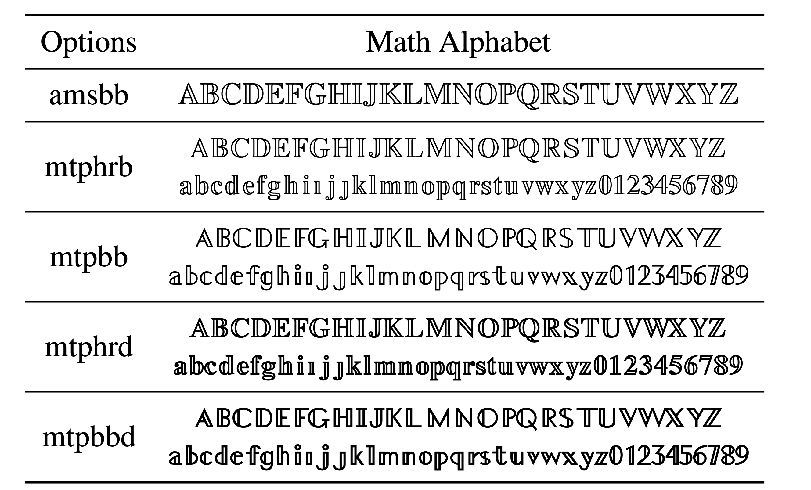

> 本教程仅在 mac 系统下经过测试，windows 用户请自行测试。

## 介绍

MathTime Professional II 是一款由 [Michael Spivak](https://en.wikipedia.org/wiki/Michael_Spivak) 设计的很优美的数学字体，它被很多数学专著和期刊所使用。

该字体提供两个版本，Complete 版和 Lite 版。顾名思义，Complete 版为完整版，提供了所有设计功能，而 Lite 版为非完整版，只提供了部分设计功能。特别地，下面列出的特性只能在完整版中使用：

+ Bold math fonts, except for the bold upright math alphabets `\mathbf` and `\mbf`, and for the bold versions of the CM Calligraphic and the Euler fonts
+ Times-compatible script, curly, fraktur and 'blackboard bold' fonts
+ AMS symbols

## 安装步骤

1. 要么直接从[官网](https://www.pctex.com/mtpro2.html)下载字体资源（需要付费购买版权），要么从 [Github 仓库](https://github.com/armeyer/mcs_web/tree/master/macros/mtp2fonts/texmf)下载 `texmf` 文件夹至本地。
2. `texmf` 文件夹里面有 `doc`、`dvips`、`fonts`、`source`、`tex` 以及 `tpm` 这 6 个子文件夹。
3. 为了叙述简便，下面将 `texmf-local` 这一文件夹作为绝对路径描述的起始文件夹。

   + 将 `doc` 中的文件拷贝到路径 `texmf-local/doc/mtpro2` 下（注意：`texmf-local/doc` 路径下本来是没有 `mtpro2` 的，为了方面管理，建议在 `texmf-local/doc` 下创建一个 `mtpro2` 文件夹，下同）。
   + 将 `dvips` 中的文件拷贝到路径 `texmf-local/dvips/local/mtpro2` 下。
   + 将 `fonts/tfm` 中的文件拷贝到路径 `texmf-local/fonts/tfm/local/mtpro2` 下。
   + 将 `fonts/type1` 中的文件拷贝到路径 `texmf-local/fonts/type1/local/mtpro2` 下。
   + 将 `source/latex/mtpro2` 中的 `dtx` 和 `ins` 文件拷贝到路径 `texmf-local/source/latex/mtpro2` 下。
   + 将 `tex/latex/mtpro2` 里面的 `mtpro2.sty` 和其它几个文件拷贝路径 `texmf-local/tex/latex/local/mtpro2` 下。
   + 将 `tex/plain/mtpro2` 里面的 `mtp2.tex` 拷贝到路径 `texmf-local/tex/plain/local/mtpro2` 下。
   + 将 `tpm/package` 里面的 `tpm` 文件拷贝到路径 `texmf-local/tpm/package` 下。
4. 终端运行 `sudo mktexlsr` 刷新文件名数据库。
5. 终端运行 `sudo updmap-sys --enable Map=mtpro2.map`。
6. 终端运行 `sudo updmap-sys --disable Map=belleek.map`。
7. 终端运行 `texdoc mtpro2` 和 `texdoc guide2` 阅读字体使用手册。

## 宏包使用

### 文本字体搭配

`mtpro2` 和 Times 风格字体搭配最为融洽，目前使用 Times 风格字体的常用方法有：

+ 使用 `newtxtext` 宏包调用波兰 $\TeX$ 用户组开发的复刻字体 $\TeX$ Gyre Termes [^newtxtext]
+ 重定义 `\renewcommand{\rmdefault}{ptm}` 以使用 Adobe Times
+ 使用 `fontspec` 宏包调用 Times New Roman 或者 Times 字体

### Blackboard Bold Math Alphabet

`mtpro2` 提供了多个版本的 Blackboard Bold 数学字母表，具体见下表：

<figure>
  
  <figcaption markdown="span">Blackboard Bold 数学字母表（[图片源代码](https://github.com/SwitWu/mtpro2blackboard)）</figcaption>
</figure>

需要注意的是 `amsbb` 选项只提供大写字母字母表，不支持小写字母和阿拉伯数字。

## 一些问题

+ 如何将数学模式中的中括号字体改用相应的文本模式字体？

  `mtpro2.dtx` 中源码为：

  ```latex
  \DeclareMathDelimiter{[}{\mathopen} {letters}{140}{largesymbols}{"02}
  \DeclareMathDelimiter{]}{\mathclose}{letters}{141}{largesymbols}{"03}
  ```

  这里的 `letters` 数学符号字体来自 `\mathnormal`，我们需要将其改为 `operators`（来自 `\mathrm`），如下所示：

  ```latex
  \DeclareMathDelimiter{[}{\mathopen} {operators}{`[}{largesymbols}{"02}
  \DeclareMathDelimiter{]}{\mathclose}{operators}{`]}{largesymbols}{"03}
  ```

## 注释

<div id="footnotes"></div>

## 参考

+ [MathTime Professional 2 Fonts](https://www.pctex.com/mtpro2.html)
+ [Change the font of brackets in the math mode for mtpro2](https://tex.stackexchange.com/questions/666618/change-the-font-of-brackets-in-the-math-mode-for-mtpro2)

[^newtxtext]: 在 mac 下 `newtxtext` 是调用这个字体，其它系统下我没有测试。
