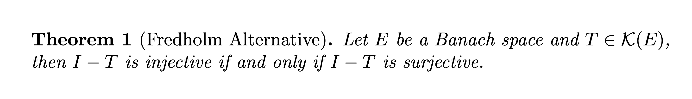
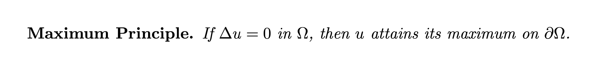
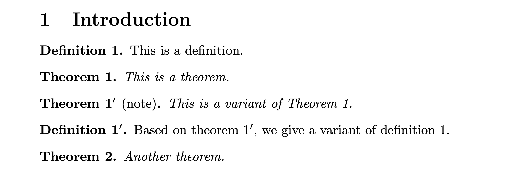

## 介绍

amsthm 是美国数学会开发的用于定理类环境的宏包，它为用户提供了两个主要的宏：

+ `\newtheorem`
+ `\theoremstyle`

用于定义定理类环境，另外，amsthm 还提供了一个 `proof` 环境，用于填写证明过程。
> 如果 amsthm 宏包与非 AMS 文档类以及 amsmath 宏包一起使用，需要先调用 amsmath 再调用 amsthm。

## 定义定理类环境

使用 `\newtheorem` 便可以定义定理类环境，例如
```latex
\newtheorem{theorem}{Theorem}
```
为我们定义了一个名为 `theorem` 的环境。

接下来便可以直接使用该环境，例如：
```latex
\begin{theorem}
  This is a theorem.
\end{theorem}
```

<figure>
  
  <figcaption markdown="span"></figcaption>
</figure>

从编译后的结果图中可以看出，定理头由指定的文本 `Theorem`、自动生成的定理编号以及标点符号 `.` 组成，并且定理头部分被自动加粗。而 `theorem` 环境中的内容 `This is a theorem.` 以意大利斜体形式接在定理头后面。

如果不想让 `theorem` 环境自动编号，则需要使用 `\newtheorem` 的变体 `\newtheorem*`，即

```latex
\newtheorem*{theorem}{Theorem}
```

我们还可以为 `theorem` 环境添加一个可选参数以提供附加信息，例如：

```latex
\begin{theorem}[Fredholm Alternative]
  Let $E$ be a Banach space and $T\in\mathcal{K}(E)$,
  then $I-T$ is injective if and only if $I-T$ is surjective.
\end{theorem}
```

<figure>
  
  <figcaption markdown="span">给定理类环境添加可选参数</figcaption>
</figure>

可以看到，可选参数被圆括号包裹后放置于定理编号和标点符号 `.` 之间。

有时候，我们想要类似于下面的效果（用来「强调某个定理的独特性和重要性」）：

<figure>
  
  <figcaption markdown="span"></figcaption>
</figure>

这时，我们可以巧妙地运用 `\newtheorem*` 来实现这一效果：

```latex
%-----导言区-----
\newtheorem*{MP}{Maximum Principle}
%-----正文-----
\begin{MP}
  If $\Delta u = 0$ in $\Omega$, then $u$ attains its maximum on $\partial\Omega$.
\end{MP}
```

## 定理编号

定理类环境既可以拥有自己独立的计数器，也可以依附于某个上级计数器，或者与其它环境共享同一个计数器。

### 依附于上级计数器

语法为：

```latex
\newtheorem{<环境名>}{<定理头文本>}[<上级计数器>]
```

例如：

```latex
\newtheorem{theorem}{Theorem}[section]
```

将使得 `theorem` 为 `section` 的下级计数器，且 `theorem` 环境的计数格式形如 **Theorem 1.1**、**Theorem 1.2**， 当 `section` 自增时，`theorem` 重置为零。

### 共享计数器

语法为：

```latex
\newtheorem{<环境名>}[<共享计数器>]{<定理头文本>}
```

例如，我们经常将定理、引理和推论放在一起连续编号：

```latex
\newtheorem{theorem}{Theorem}
\newtheorem{lemma}[theorem]{Lemma}
\newtheorem{corollary}[theorem]{Corollary}
```

## 修改环境格式

### 定理风格以及 `\theoremstyle`

在 amsthm 中有一个概念叫做定理风格，它决定着由 `\newtheorem` 定义的环境的具体格式，有三种定理风格是预定义的，它们分别是：

+ `plain`: 环境内容使用意大利斜体，环境上下方添加额外间距
+ `definition`: 环境内容使用罗马正体，环境上下方添加额外间距
+ `remark`: 环境内容使用罗马正体，环境上下方不添加额外间距

当我们不显式指定定理风格时，默认使用 `plain` 风格。而当我们需要显式指定某一定理风格时，就要用到本文开头所提到的 `\theoremstyle` 命令。例如定义 `definition` 风格的环境 `defn`：

```latex
\theoremstyle{definition}
\newtheorem{defn}{Definition}
```

### 交换定理编号与定理名的位置

有时候我们想要类似于 **1.1 定理** 这样的效果，这时可以使用 amsthm 提供的 `\swapnumbers`，该命令对在它后面定义的定理类环境起作用，而对在它前面定义的定理类环境不起作用，比方说，

```latex
\documentclass{article}
\usepackage{amsthm}
\theoremstyle{definition}
\newtheorem{definition}{Definition}

\swapnumbers

\theoremstyle{plain}
\newtheorem{theorem}{Theorem}[section]
\begin{document}

\section{Introduction}\label{sec:1}

\begin{definition}
  This is a definition.
\end{definition}

\begin{theorem}
  This is a theorem.
\end{theorem}

\end{document}
```

<figure>
  
  <figcaption markdown="span"></figcaption>
</figure>

> 为了格式上的一致性，还是建议将 `\swapnumbers` 放在最前面，使其作用于所有定理类环境。

### 自定义定理风格

虽然 amsthm 预定义了三种定理风格，但是并不能满足所有用户的需求，于是 amsthm 干脆提供了一个自定义定理风格的接口，叫做 `\newtheoremstyle`，使用方法为：

```latex
\newtheoremstyle{<风格名>}
                {<上方间距>} % 若留空，则使用默认值
                {<下方间距>} % 若留空，则使用默认值
                {<主体字体>} % 如 \itshape
                {<缩进长度>} % 若留空，则无缩进；可以使用 \parindent 进行正常段落缩进
                {<定理头字体>} % 如 \bfseries
                {<定理头后的标点符号>} % 如点号、冒号
                {<定理头后的间距>} % 不可留空，若设置为 { }，则表示正常词间间距；若设置为 {\newline}，则环境内容开启新行
                {<定理头格式指定>} % 一般留空
```

于是，最简洁的定理风格便是这样的：

```latex
\newtheoremstyle{<style name>}{}{}{}{}{}{}{ }{}
```

但是这样做没什么意义，该强调的没有被强调出来！😅

> 顺便提供一个相应的 VS Code 用户代码片段（关于配置用户代码片段的内容，请见另一篇文章 [Visual Studio Code 的正确打开方式](https://switwu.github.io/2022-11-17-vscode/)）：
>
>  ```json
>  "newtheoremstyle":{
>  "prefix": "nts",
>  "body": ["\\newtheoremstyle{$1}",
>            "\t\t\t\t\t\t\t\t{$2} % 上方间距",
>            "\t\t\t\t\t\t\t\t{$3} % 下方间距",
>            "\t\t\t\t\t\t\t\t{$4} % 主体字体",
>            "\t\t\t\t\t\t\t\t{$5} % 缩进长度",
>            "\t\t\t\t\t\t\t\t{$6} % 定理头字体",
>            "\t\t\t\t\t\t\t\t{$7} % 标点符号",
>            "\t\t\t\t\t\t\t\t{$8} % 定理头后间距",
>            "\t\t\t\t\t\t\t\t{$9} % 定理头格式指定"]
>  }
>  ```


## 一些特殊情形 🧐

### 需要将定理环境的可选参数加粗

可以将 `\newtheoremstyle` 的第九个参数 `<定理头格式指定>` 派上用场了😎，例如，我们按如下方式定义定理风格 `bfnote`:

```latex
\newtheoremstyle{bfnote}
                {} % 上方间距
                {} % 下方间距
                {} % 主体字体
                {} % 缩进长度
                {\bfseries} % 定理头字体
                {.} % 标点符号
                { } % 定理头后间距
                {\thmname{#1}\thmnumber{ #2}\thmnote{ (#3)}} % 定理头格式指定
```

然后以此为基础定义一个定理类环境 `note`:

```latex
\theoremstyle{bfnote}
\newtheorem{note}{Note}
%-----正文-----
\begin{note}[optional argument]
This is a note.
\end{note}
```

<figure>
  
  <figcaption markdown="span">利用第九个参数将可选参数加粗</figcaption>
</figure>


### 需要编号形如 $n^\prime$ 的定理头

有些时候会遇到这样的情况：后面的某个定理是前面某个定理的变体，此时我们希望两个定理的编号分别为 $n$ 和 $n^\prime$。

如果不涉及到 `hyperref` 宏包，那么方案要简单一些：

```latex
\documentclass{article}
\usepackage{amsthm}
\theoremstyle{definition}
\newtheorem{definition}{Definition}

\theoremstyle{plain}
\newtheorem{theorem}{Theorem}

\NewDocumentEnvironment{variant}{O{theorem} D(){} m}
  {\addtocounter{#1}{-1}%
   \expandafter\renewcommand\csname the#1\endcsname{\ref{#3}$'$}%
   \begin{#1}[#2]}
  {\end{#1}}

\begin{document}

\section{Introduction}\label{sec:1}

\begin{definition}\label{defn:1}
  This is a definition.
\end{definition}

\begin{theorem}\label{thm:1}
  This is a theorem.
\end{theorem}

\begin{variant}(note){thm:1}\label{thm:1prime}
  This is a variant of Theorem \ref{thm:1}.
\end{variant}

\begin{variant}[definition]{defn:1}
  Based on theorem \ref{thm:1prime}, we give a variant of definition \ref{defn:1}.
\end{variant}

\begin{theorem}
  Another theorem.
\end{theorem}

\end{document}
```

<figure>
  
  <figcaption markdown="span"></figcaption>
</figure>

如果涉及到 `hyperref` 宏包，可以参考 [egreg](https://tex.stackexchange.com/users/4427/egreg) 提供的方法：

```latex
\makeatletter
\newcommand{\neutralize}[1]{\expandafter\let\csname c@#1\endcsname\count@}
\makeatother

\NewDocumentEnvironment{variant}{O{theorem} m}
  {\neutralize{#1}\phantomsection%
   \expandafter\renewcommand\csname the#1\endcsname{\ref*{#2}$'$}%
   \begin{#1}}
  {\end{#1}}
```

## `proof` 环境

源码中 `proof` 环境的定义如下：

```latex
\newenvironment{proof}[1][\proofname]{\par
  \pushQED{\qed}%
  \normalfont \topsep6\p@\@plus6\p@\relax
  \trivlist
  \item[\hskip\labelsep
        \itshape
    #1\@addpunct{.}]\ignorespaces
}{%
  \popQED\endtrivlist\@endpefalse
}
\providecommand{\proofname}{Proof}
```

+ 证明环境的头文本默认为 `Proof`，可以通过可选参数更改，如
  ```latex
  \begin{proof}[Proof of Theorem 2.5, concluded]
    some text
  \end{proof}
  ```
+ 证明环境的头文本字体默认为 `\itshape`，可根据需要使用其他字体，如 `\bfseries`
+ `proof` 环境可以嵌套使用
+ `\ignorespaces` 为 $\TeX$ 原语，作用为无视其后面的所有空格（无论是显式空格或者 `\space`），直到遇到第一个非 space token

+ `\p@` 的定义为：
  ```latex
  \newdimen\p@ \p@=1pt
  ```
  `\@plus` 的定义为：
  ```latex
  \def\@plus{plus}
  ```


## 最后的最后

今天是 2022 年的最后一天，祝大家新年快乐。

## 参考

+ [Using the `amsthm` Package](https://www.ctan.org/pkg/amsthm)
+ [How do I make a Theorem $n$ followed by a Theorem $n^\prime$?](https://tex.stackexchange.com/questions/21506/how-do-i-make-a-theorem-n-followed-by-a-theorem-n)
+ [$\TeX$ FAQ: $\LaTeX$ internal “abbreviations”, etc.
](https://texfaq.org/FAQ-ltxabbrv)
+ [`\ignorespaces` vs `\relax`](https://tex.stackexchange.com/questions/671478/ignorespaces-vs-relax)