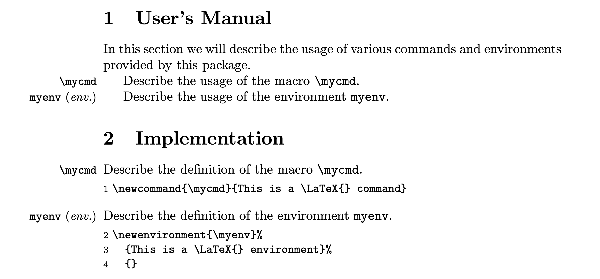

## 介绍

$\LaTeX$ 文学编程的思想最初由 Donald Knuth 提出并使用，现如今，不计其数的宏包开发者都以文学编程的方式编写发布他们的作品。简单说来，文学编程就是把 $\LaTeX$ 代码和文档放在一起，置于同一个源文件之中。

举个例子，假如你现在需要编写一个宏包（名为 demo），如果不按文学编程的路子走的话，你至少需要准备两个文件：一个是宏包源文件 `demo.sty` （用户通过 `\usepackage{demo}` 调用此文件），另一个是用户文档（或者称为用户手册）`demo.pdf`（通过 `demo.tex` 编译生成）。而通过文学编程，我们可以将 `demo.sty` 和 `demo.tex` 结合起来放在同一个源文件 `demo.dtx` 之中（源文件的文件后缀名一般为 `.dtx`，取自 **d**ocumented la**t**e**x**）。

## 文学编程的工具 —— doc 宏包

### 介绍与演示

一般而言，`.dtx` 源文件主要包含两部分内容：代码和文档（code and documentation），代码部分不以 `%` 开头，而文档部分都以 `%` 开头。

在编写 `.dtx` 源文件的过程中我们要用到 doc 宏包提供的各种命令及环境，此宏包由 Frank Mittelbach 编写。这里我们先从 doc 宏包中取出五个主要的命令与环境用于演示，它们是：

+ 命令
  + `\DescribeMacro`：接受一个宏参数，表示现在要介绍该宏的用法。将该宏名打印在边注区，并创建索引条目。
  + `\DescribeEnv`：接受一个环境名参数，表示现在要介绍该环境的用法。将该环境名打印在边注区，并创建索引条目。
+ 环境
  + `macro`：接受一个宏参数，表示现在要解释该宏的定义。将该宏名打印在边注区，并创建索引条目。
  + `environment`：接受一个环境名参数，表示现在要解释该环境的定义。将该环境名打印在边注区，并创建索引条目。
  + `macrocode`：此环境中的代码一码两用，既可以写入目标文件，又可以逐字抄录进入文档。

上面这些解释你可能听起来比较晕，不要急，看完下面的示例你就会明白具体的意思！

下面写一份实例代码 (文件名为 `demopkg.dtx`)：

```tex
% \section{User's Manual}
% 
% In this section we will describe the usage of various commands and environments
% provided by this package.
%
% \DescribeMacro{\mycmd}
% Describe the usage of the macro \verb|\mycmd|.
%
% \DescribeEnv{myenv}
% Describe the usage of the environment \verb|myenv|.
%
% \section{Implementation}
%
% \begin{macro}{\mycmd}
% Describe the definition of the macro \verb|\mycmd|.
%    \begin{macrocode}
\newcommand{\mycmd}{This is a \LaTeX{} command}
%    \end{macrocode}
% \end{macro}
% \begin{environment}{myenv}
% Describe the definition of the environment \verb|myenv|.
%    \begin{macrocode}
\newenvironment{myenv}%
  {This is a \LaTeX{} environment}%
  {}
%    \end{macrocode}
% \end{environment}
```

关于 `macrocode` 环境需要说明：

+ 在 `%` 和 `\end{macrocode}` 之间必须有四个空格符
+ `\begin{macrocode}` 和 `\end{macrocode}` 之间的代码行不应该以 `%` 开头

事实上，可以直接在导言区 `\input{demopkg.dtx}` 来使用 `\mycmd` 命令和 `myenv` 环境。除此之外，后面将通过 DocStrip 程序从 `demopkg.dtx` 中剥离出宏包文件 `demopkg.sty`。

### 获取 PDF 文档

为了得到 PDF 文档，有两种方法：


+ 方法一：创建独立的驱动文件（将其中的代码称为驱动代码），一个简短的驱动文件（假设文件名为 `demopkg.tex`）如下：

  ```tex
  \documentclass{article}
  \usepackage{doc}
  \CodelineIndex
  \begin{document}
    \DocInput{demopkg.dtx}
  \end{document}
  ```

   使用 $\LaTeX$ 格式[^compile-command]编译 `demopkg.tex` 就可以得到文档 `demopkg.pdf`:

   [^compile-command]: 编译命令有 `latex`、`pdflatex`、`xelatex`、`lualatex`，对于纯英文推荐使用 `pdflatex`，对于中英文混排则推荐使用 `xelatex` 或者 `lualatex`。

   <figure>
      
      <figcaption markdown="span">编译生成 `demopkg.pdf`</figcaption>
    </figure>

   一般而言我们不会用「创建独立的驱动文件」这种方式，而是用下面的主流方式：
+ 方法二：将驱动文件并入 `demopkg.dtx` 之中：

   ```tex
   % \iffalse
   \documentclass{article}
   \usepackage{doc}
   \CodelineIndex
   \begin{document}
     \DocInput{demopkg.dtx}
   \end{document}
   % \fi
   %
   % \section{User's Manual}
   % 
   % In this section we will describe the usage of various commands and environments
   % provided by this package.
   %
   % \DescribeMacro{\mycmd}
   % Describe the usage of the macro \verb|\mycmd|.
   %
   % \DescribeEnv{myenv}
   % Describe the usage of the environment \verb|myenv|.
   %
   % \section{Implementation}
   %
   % \begin{macro}{\mycmd}
   % Describe the definition of the macro \verb|\mycmd|.
   %    \begin{macrocode}
   \newcommand{\mycmd}{This is a \LaTeX{} command}
   %    \end{macrocode}
   % \end{macro}
   % \begin{environment}{myenv}
   % Describe the definition of the environment \verb|myenv|.
   %    \begin{macrocode}
   \newenvironment{myenv}%
     {This is a \LaTeX{} environment}%
     {}
   %    \end{macrocode}
   % \end{environment}
   ```

   此时我们直接编译 `demopkg.dtx` 文件，第一次读取 `demopkg.dtx` 时，`%` 为正常的注释符，由于这个时候驱动代码不在 `%` 后面，所以驱动代码会被执行，从 `\documentclass{article}` 开始，到 `\end{document}` 结束。在这个过程当中，第六行的 `\DocInput{demopkg.dtx}` 会二次读取文件 `demopkg.dtx`，但是这个时候，`%` 会被忽略掉，因此我们需要在驱动代码块上下方分别添加 `\iffalse` 和 `\fi` 以避免驱动代码块二次读入。

### 条件代码（Conditional Code）

#### 基本介绍

由于 doc 系统最开始并不能满足 $\LaTeX$ 开发者的一些需求，比如：从一个源文件中有条件性地抽取代码生成多个目标文件或者从多个源文件中抽取代码生成一个目标文件。于是乎，doc 系统从两个方面进行了改进：

+ 建立语法用于标记代码块，这些代码块可以被单独引用
+ 拓展 DocStrip 程序，提供了专门的脚本语言，用于根据标记代码生成目标文件

标记代码块的方式为：

```tex
%<*tagname>
    some lines of the code
%</tagname>
```
和
```tex
%<tagname> one line of code
```

其中第一种方式用于标记多行代码[^occupy-seperate-line]，第二种方式用于标记单行代码。`tagname` 是标签名，按照习惯，一般使用 `driver` 标记驱动代码、`package` 标记宏包代码、`class` 标记文档类代码等，你会在 `.dtx` 文件中经常见到这些标签名。但是请注意，使用这些标签名只是习惯而已，自己标记代码块的时候可以随便选取标签名。

[^occupy-seperate-line]: 注意：第一种方式中的 `%<*tagname>` 和 `%</tagname>` 必须单独各占一行。

我们还可以利用 `|` (逻辑或)、`&` (逻辑且) 和 `!` (逻辑否) 将多个标签名串起来，例如：

```tex
%<*Aname|Bname&!Cname>
    some lines of code
%</Aname|Bname&!Cname>
```

它表示：如果 `tag-list` 中 (见下面的 `\generate`)

+ 含有 `Aname`，或者
+ 含有 `Bname` 但不含 `Cname`

这段代码就会被引用。

#### 举例

##### Example 1: [classes.dtx](https://github.com/latex3/latex2e/blob/0b358df21d1a44aeda00d59a029fb4b0180967b1/base/classes.dtx#L797-L805)

```tex
%<*10pt|11pt|12pt>
\if@twocolumn
  \setlength\parindent{1em}
\else
%<10pt>  \setlength\parindent{15\p@}
%<11pt>  \setlength\parindent{17\p@}
%<12pt>  \setlength\parindent{1.5em}
\fi
%</10pt|11pt|12pt>
```

这是一个典型的嵌套式标记代码块，其中
```tex
\if@twocolumn
  \setlength\parindent{1em}
\else
\fi
```
这四行代码被 `10pt`、`11pt` 和 `12pt` 共用，即，只要 `tag-list` 中含有 `10pt`、`11pt` 或 `12pt` 之一，就会引用这四行代码，然后剩下的三行代码就是嵌套在里面的标记代码块，用于在单栏排版中根据不同的文档类选项设置不同的 `\parindent`。例如如果 `tag-list` 中的标签为 `10pt`，那么抽取出的代码就是
```tex
\if@twocolumn
  \setlength\parindent{1em}
\else
  \setlength\parindent{15\p@}
\fi
```


## DocStrip 工具

### 介绍

DocStrip 程序最开始是由 Frank Mittelbach 通过底层 $\TeX$ 语言编写的，后来 Denys Duchier、Johannes Braams、Marcin Woliński、Mark Wooding 等人对其进行了改进。DocStrip 程序的主要功能有：

+ 从源文件中剥离文档部分，即，以单个 `%` 开头的代码行（标签行除外）
+ 从源文件中生成目标文件，如 `.sty` 文件、`.cls` 文件
+ 自动将生成的文件安装至指定的目录中

### 使用 DocStrip 程序

#### 方式一

直接在命令行交互式执行 DocStrip 程序

```sh
tex/latex docstrip.tex
```
上面的 `/` 表示二选一，回车后，$\LaTeX$ 会询问几个问题，用户依次回答之后，DocStrip 会据此完成它的工作。此方式只适用于从源文件中剥离文档部分，现在不常用。

#### 方式二

写一个脚本文件（后缀名一般为 `.ins`），脚本文件的一般形式为：

```tex
\input docstrip
<other DocStrip commands>
\endbatchfile
```

注意第一行使用的是 $\TeX$ 原语 `\input`，这意味着我们既可以用 $\LaTeX$ 格式运行脚本文件，也可以用 $\TeX$ 格式运行脚本文件。

`<other DocStrip commands>` 中的核心命令是 `\generate`：

```tex
\generate{\file{result-file-1}{\from{source-file-1}{tag-list-1}
                               \from{source-file-2}{tag-list-2}
                               ...
                               \from{source-file-n}{tag-list-n}}
          ...
          \file{result-file-n}{...}
         }
```

`\generate` 的参数可以含多个 `\file`，`\file` 的第二个参数可以含多个 `\from`，`tag-list` 就是由前面所说的标签名构成的列表（标签名由逗号隔开）。举个例子：

```tex
\generate{\file{demopkg.sty}{\from{demopkg.dtx}{package}}}
```

表示从 `demopkg.dtx` 中抽取被 `package` 标签标记的代码块以及未被标记的代码块，将所有这些代码块串联起来生成宏包文件 `demopkg.sty`。

现在我们创建一个脚本来处理上面的 `demopkg.dtx` 源文件，将脚本文件命名为 `demopkg.ins`，内容如下：

```tex
\input docstrip.tex
\keepsilent
\askforoverwritefalse
\generate{
  \file{demopkg.sty}{\from{demopkg.dtx}{package}}
}
\endbatchfile
```

> 关于 `\keepsilent`、`\askforoverwritefalse` 等命令的意义，请查阅 DocStrip 手册。

然后 `demopkg.dtx` 文件也需要稍作修改：

```tex
% \iffalse
%<*driver>
\documentclass{article}
\usepackage{doc}
\CodelineIndex
\begin{document}
  \DocInput{demopkg.dtx}
\end{document}
%</driver>
% \fi
%
% \section{User's Manual}
% 
% In this section we will describe the usage of various commands and environments
% provided by this package.
%
% \DescribeMacro{\mycmd}
% Describe the usage of the macro \verb|\mycmd|.
%
% \DescribeEnv{myenv}
% Describe the usage of the environment \verb|myenv|.
%
% \section{Implementation}
%
%    \begin{macrocode}
%<*package>
\NeedsTeXFormat{LaTeX2e}
\ProvidesPackage{demopkg}
%    \end{macrocode}
% \begin{macro}{\mycmd}
% Describe the definition of the macro \verb|\mycmd|.
%    \begin{macrocode}
\newcommand{\mycmd}{This is a \LaTeX{} command}
%    \end{macrocode}
% \end{macro}
% \begin{environment}{myenv}
% Describe the definition of the environment \verb|myenv|.
%    \begin{macrocode}
\newenvironment{myenv}%
  {This is a \LaTeX{} environment}%
  {}
%</package>
%    \end{macrocode}
% \end{environment}
```

可以看到，我们用 `driver` 标签标记了驱动代码，在第二节的开头添加了宏包必不可少的标识节[^clsguide]，然后用 `package` 标签标记了第二节（因为宏包代码都在这一节之中），然后命令行执行：

```sh
tex demopkg.ins
```

或者

```sh
latex demopkg.ins
```

DocStrip 执行任务之后，便会生成宏包文件 `demopkg.sty`。

<details>
  <summary>
    问：如果不用 <code>driver</code> 标记驱动代码会怎么样？
  </summary>
  驱动代码块也会被写入 <code>demopkg.sty</code> 之中，这可不是我们想要的结果。
</details>

#### 方式三

部分项目如 `ctex` 和 `wrapstuff` 将脚本 `.ins` 文件合并到 `.dtx` 文件中，其内容看起来虽然更加复杂，但是核心框架容易分析出来：

```tex
% \iffalse meta-comment
% 一些魔法注释，如 !TeX program = XeLaTeX
%<*internal>
\iffalse
%</internal>
%<*readme>
项目的 README 文件内容
%</readme>
%<*internal>
\fi
\begingroup
  \def\temp{LaTeX2e}
\expandafter\endgroup\ifx\temp\fmtname\else
\csname fi\endcsname
%</internal>
%<*install>
\input ctxdocstrip %
\generate{...}
\endbatchfile
%</install>
%<*internal>
\fi
%</internal>
%<*driver>
\documentclass{ltxdoc} ^^M 或者其它文档类，如 ctex.dtx 使用的 ctxdoc
\begin{document}
  \DocInput{\jobname.dtx}
  \PrintChanges
  \PrintIndex
\end{document}
%</driver>
% \fi
% code and documentation ...
```

使用 plain $\TeX$ 格式运行 `.dtx` 文件会启动 DocStrip 程序，生成目标文件（根据 `\generate` 里的具体指令）；使用 `latex` 格式运行会生成 PDF 手册。具体分析见 [David Carlisle](https://tex.stackexchange.com/a/690145/241621) 在 TSE 的回答。

## 注释

<div id="footnotes"></div>

## 参考

+ Frank Mittelbach, The $\LaTeX$ Companion, Chapter 14
+ [The `doc` and `shortvrb` Packages](https://ctan.org/pkg/doc)
+ [The DocStrip Program](https://ctan.org/pkg/docstrip)
+ Scott Pakin, How to Package Your $\LaTeX$ Package. `texdoc dtxtut`.
+ [TSE. Merge the ins file into dtx file](https://tex.stackexchange.com/questions/690129/merge-the-ins-file-into-dtx-file)
    
[^clsguide]: 见 clsguide