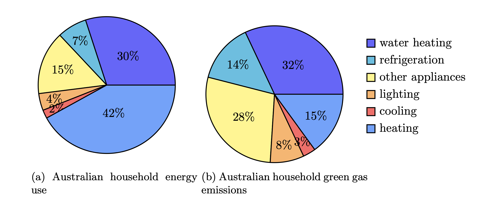
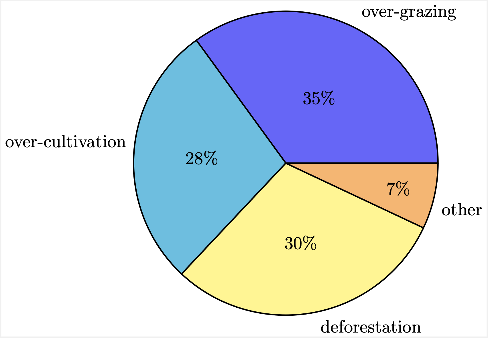
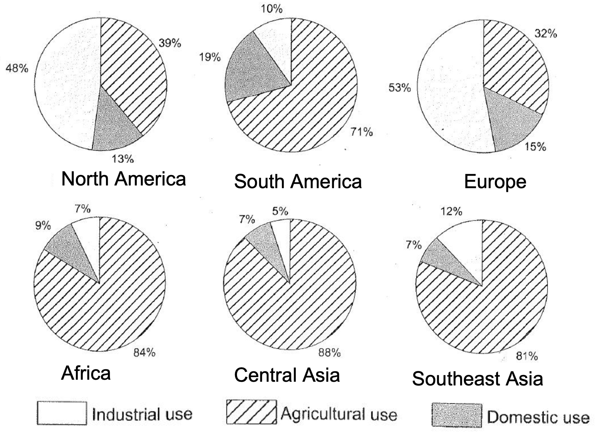

## 图表类型

+ 数据类
  + line graph 线图
  + bar chart 柱图
  + pie chart 饼图
  + table 表格
  + 混合数据图
+ 非数据类
  + flow chart 流程图
  + map 地图

另外数据类又可以按照动态图和静态图来划分。

## 评分标准

小作文有四项评分标准，分别是：

+ TA (Task Achievement 任务完成度)
+ CC (Coherence and Cohesion 连贯与衔接)
+ LR (Lexical Resources 词汇丰富度)
+ GR&A (Grammatical Range & Accuracy 语法范围与准确度)

## 动态图写作

### 首段改写

+ 改写的四要素：谓语动词（谓）、描述对象（主、宾）、时间、地点
+ 改写的三角度：同义替换、概括与具体、句式变换

#### 谓语动词的改写

+ 提供信息
  + give information about
  + provide
  + present
  + compare
+ 展示变化
  + illustrate/demonstrate changes of sth
  + illustrate how sth changed/varied

#### 描述对象的改写

+ information $\to$ data, statistics
+ figure $\to$ the amount/number/quantity of
+ proportion $\to$ percentage
+ kinds $\to$ types, categories, forms, groups, parts
+ men and women $\to$ males and females
+ people $\to$ individuals, person, population, residents, citizens
+ family $\to$ household, domestic
+ spending $\to$ costs, expenses, expenditure, budget

#### 时间的改写

+ 时间段的描述
  + from 2000 to 2020
  + between 2000 and 2020
  + over the period between 2000 and 2020
  + over the 2000--2020 period
  + over the 20-year period
  + over the two decades (特殊数据观察)
+ 时间点的描述：列举年份（当年份数 $\leq 3$）或概括年份数量

#### 地点的改写

单个地点时，考虑名词和形容词互换（如 people from America 换成 Amercian people）;多个地点时，列举地点名称或概括其数量。

### 结尾段（总结段）

+ 结尾段非常重要（没有结尾段 TA 不会超过 5 分）
+ 位置灵活，可以放在最后写，也可以放在第一段后面
+ 不要用 in conclusion 和 to conclude，建议用 overall, to sum up
+ 最好不要出现数据
+ 不要分析数据变化的原因，也不要给建议

### 动态图基本句型

1. 描述对象作主语
2. 变化趋势作主语
3. 时间作主语
4. There be 句型

> 举例：1920 年到 2019 年间，每周每个家庭花在家务事上的时间从 50 小时下降至 10 小时。
> 1. From 1920 to 2019, the number of hours spent on housework in a household per week decreased significantly from 50 hours to 10 hours.
> 2. A significant decrease from 50 hours to 10 hours occured in the number of hours spent on housework in a household per week during the 1920-2019 period.
> 3. The period between 1920 and 2019 witnessed a significant decrease from 50 hours to 10 hours in the number of hours spent on housework in a household per week.
> 4. There was a significant decrease from 50 hours to 10 hours in the number of hours spent on housework in a household per week between 1920 and 2019.

### 单线描写

#### 变化趋势、最高点、最低点

+ 四种变化趋势
  + 上升：increase, rise, grow, climb, soar, surge (最后两个慎用)
  + 下降：decrease, fall, go down, decline, drop, plunge, slump
  + 波动：fluctuate
  + 持平：level off at, remain the same at, remain unchanged at, stabilize at
+ 最高点
  + （名词）the peak/the top/the highest point $+$ at some amount
  + （动词）reach the peak at, increase to the peak at, peak at
+ 最低点
  + （名词）the bottom, the lowest point
  + （动词）reach the bottom at, decrease to the bottom at, bottom out at

> 例：Starting from 0 in 1960, this figure rose continually to its peak at about 15% in the first 2 decades.

#### 程度副词

+ 显著地：significantly, dramatically, drastically, sharply, notably, noticeably, markedly,  substantially, considerably
+ 轻微地：slightly, marginally, gradually
+ 适中地：modestly, moderately

主体段第一句常用：
+ According to $\cdots$
+ As is shown in $\cdots$

描述数据，表示大约、高于、低于、超过等的常见词汇：

+ 近似地、大约：about, around, approximately
+ 几乎：almost, nearly
+ 多达：up to, as much as
+ 高于：above, over, more than
+ 低于：below, under, less than
+ 仅仅：only, mere, merely
+ 超过：outnumber(在数量上超过), overtake [在描述动态图的交点时经常用]

> 例：In our office the women outnumber the men three to one.
我们办公室女性多于男性，比例为 3 比 1。
 

#### 主语的替换

重复使用相同的主语不太好，可以通过下面的方式将主语多样化：

+ 代词
+ 省略
+ 替换/改写

试比较下面两段话：

> According to the chart, at first, at 6am **the number of people** at the station stands at only 100. Then, **the number** shoots up over the next two hours and peaks at 400 at 8am. In the following 2 hours, **the number** declines rapidly and bottoms out at 180 at 10am. The period between 10 o'clock and 12 o'clock experiences a slight growth in **the number of people** in the station to 280 at midday.

> According to the chart, at first, at 6am **the number of people** at the
  station stands at only 100. Then, **it** shoots up over the next two hours and peaks at 400 at 8am. In the following 2 hours, **subway passengers/peope taking subway** declines rapidly and bottoms out at 180 at 10am. The period between 10 o'clock and 12 o'clock experiences a slight growth ~~in the number of people in the station~~ to 280 at midday.

#### 衔接与时间表达

+ at first, firstly, initially
+ then, next
+ after that, afterwards
+ from this time onwards, subsequently
+ finally

#### 句式变化（两段变化合并为一句）

+ 句型一
  + 基本句 before/after 基本句
  + After v-ing, 基本句
  + 基本句, before v-ing
+ 句型二
  + 基本句 when 基本句
+ 句型三
  + 基本句, after which + 基本句
  + 基本句, which was followed by + 趋势

#### 动态图分段原则

1. 按描述对象分段：当描述对象 $\leq 3$ 时，可为每个描述对象单独写一个主体段。
2. 按趋势分段：单图包含多条曲线，对应超过三种描述对象，需合并写。可根据不同变化趋势来分段。
3. 按大小分段：当趋势相同时，按大小分段。
4. 按时间点分段（较少出现）

### 动态图总结段

总结段写整体趋势和变化大小，注意，**总结段不要写数据**。

## 静态图写作

### 三种基本句型

1. 数据类型作主语： The proportion/number/amount of 描述对象 is 数据
2. 描述对象（类别限定）作主语：描述对象（类别限定） + 占 + 数据 of the total
    > 注意：“占”不用 occupy, take up, 而用 account for, make up, constitute, comprise, compose, represent
3. 数据作主语：数据 + 描述对象 + 谓语动词 + 类别限定

> 1. The proportion of tourists who came from China is 37%.
> 2. European tourists account for 35% of all the tourists going to Australia.
> 3. 18% the tourists going to Australia come from US.

### 引出数据的方式

+ **at**
  + 用在动词后
    > After peaking at 90 billions
  + 主语为对象词时
    > The figure for resources was the highest in 1991, at 20%.
+ **with** 经常用于句子主语不是 figure/number 这类词时
  > Petrol and oil are the dominant fuel sources throughout this period, with 35 quadrillion (35q) units used in 1980.
+ **(数据)** 括号经常跟在一个名词后面
  > European, with the highest overall percentage of land degraded (23%), also suffered from over-cultivation (7.7%) and over-grazing (5.5%).
+ **定语从句或现在分词作状语**
  > Heating is the largest energy consumer, (which uses)/(using) 42% of energy.

  > Energy consumed by heating accounts for the largest proportion, making up 42%.

### 排名第一的写法

可以用 the largest, the major, the most important 等表达，例如：

+ Coal was the major fuel source, which contributed 50 units.
+ The most important fuel was coal, which produced 50 units.

### 排名第二的写法

可以把实际数据替换为 relatively/comparatively smaller/lower，然后把
数据摆在最后面，例如：

+ The percentage of energy used by water heating is relatively smaller, at 30%.
+ A relatively smaller proportion of energy is used by water heating, standing at 30%.
+ Energy used by water heating accounts for a relatively smaller proportion of the total, 
  making up 30%.

也可以使用一些句型：

+ ... rank the second.
+ ... follow closely/behind.
+ ..., followed by ...
+ This is followed by ...

### 相等或相似的表达

+ be the same as
+ be as large(比例)/much(不可数名词)/many(可数名词) as
+ be equal to
+ equal
+ be similar to

在 be 动词后面可以加 approximately、nearly、basically、roughly、almost 等副词

> 举例：两种经典句式表示相似
> 1. A accounts for 40%, which is basically equal to B (39%).
> 2. A is basically the same as B, accounting for 40% and 39% respectively.

多个数值近似的数据合并描述，例如：
> The spending in the remaining countries was similar, ranging from 15% to 17%.

### 倍数关系

be + 数字 + as large/many/much as

> Energy used by water heating is 2 times as much as that used by other appliances, making up 30% and 15% respectively.

> The proportion of energy used by water heating is 2 times as large as that used by other appliances, at 30% and 15% respectively.

### 剩余部分及最小部分（饼图适用）

remaining, remainder, minimal, least, not significant, insignificant

### 主体段结构

+ 第 $1$ 句：概括由几部分组成
+ 后 $n$ 句：（具体来说）由大到小介绍具体数据（突出比较关系）

概括描述对象被分为 $n$ 类：

+ be classified/categorised/divided into
+ fall into
+ consist of, be made up of, be comprised of
+ constitute, compose
+ There be

> As can be seen from the pie chart, the places for teenagers to get online were classified into five types.

### 静态饼图写作思路

#### 单饼图

+ 排序法：按数据大小排序依次描述
+ 合并法：先写出最大两个类别的和，再分开列举数据；然后依次写剩余部分

#### 多饼图

+ 饼图之间没有关系的话，各写一段，最后总结
+ 饼图之间有关联的话，根据共同点分组，然后再逐个写

### 举例

<figure>
  
  <figcaption markdown="span">C10-Test1</figcaption>
</figure>

> Australian household energy use is divided into six parts.
  To be more specific, energy used by heating accounts for the largest proportion, making up 42%. A further 30% of energy is used by water heating, which is 2 times as large as the figure for other appliances (15%). The remaining 13% of energy is used by refrigeration, lighting and cooling collectively, constituting 7%, 4% and 2% respectively.
>
>  The situation for greenhouse gas emissions, however, is quite different. The largest proportion of greenhouse gas is emitted by water heating, standing at 32%, followed by other appliances (28%). It is worth mentioning that gas emissions caused by heating are approximately the same as those caused by refrigeration, with 15% and 14% respectively. Besides, lighting and cooling accounts for the remaining 11% of greenhouse gas.

<figure>
  
  <figcaption markdown="span">C8-Test1: Causes of worldwide land degradation</figcaption>
</figure>

> The pie chart shows that there are four main causes of farmland becoming degraded in the world taday. Globally, 65% of degradation is caused by too much animal grazing and tree clearance, which degraded 35% and 30% respectively. A further 28% of global degradation in due to over-cultivation of crops. Other causes account for only 7% collectively.

<figure>
  
  <figcaption markdown="span">C11-Test1</figcaption>
</figure>

> The six pie charts illustrate how much water is used for industry, agriculture and households in six regions around the world.
>
> In two regions, industry is the biggest consumer of water. In Europe, slightly over a half is used by this sector, while a third is for agricultural purposes. Households use the smallest amount, 15%. In North America, water use for agriculture constitutes 39% of the total, moderately higher than that in Europe. In addition, almost a half is consumed by industry, while domestic use represents merely 13%.
>
>  The other four regions saw great use of water in the agricultural sector. Africa and central Asia use the largest amounts in agriculture, 84% and 88% respectively, while industry and households share the rest nearly equally. Around four fifths of all water consumed in Southeast Asia is for agricultural use. While 12% goes to industry, the remaining 7% is for domestic use. In South America, households are also the lowest consumer of water (one tenth), but industry uses almost twice as much. The remainder (71%) is all for agriculture.
>
>  In sum, the most developed areas among the six mainly use water for industry while the less developed ones use water mostly in the agricultural sector.

## 流程图

### 流程图特征

流程题主要有生命循环类和工业生产类

+ 特点：生词多、被动语态为主、全文用一般现在时
+ 难点：给每个步骤找动词或者补动词、提升词数

### 写作要点

+ 确定步骤，箭头数字
+ 找起点——按顺序描述
+ 步骤过多可以合并写
+ 时态：一般现在时
+ 语态：多用被动语态（表示客观事实）

### 首段改写

#### 第一句参考

+ The diagram (flow chart) demonstrates/illustrates the process/procedure of $\cdots$
+ The diagram (flow chart) demonstrates/illustrates how $\cdots$ is produced/manufactured.

#### 第二句参考

+ which can be divided into $\cdots$ steps/stages/phases.
+ and the whole process can be divided into $\cdots$ steps/stages/phases.
+ and it mainly consists of $\cdots$ steps/stages/phases.
+ and it works as follows.
+ and it involve the following steps.

### 主体段

#### 整体要求

+ 不要省略内容
+ 按照先后顺序描述
+ 灵活运用主动和被动语态

#### 流程图的要素

+ 原材料 (raw materials)
+ 设备 (equipment, apparatus)
+ 处理方法 (process method)
+ 产物或中间产物 (product)

#### 常用词汇

|操作|词汇|操作|词汇|
|:---:|:---:|:---:|:---:|
|放置|lay/place|挤压|squeeze|
|混合|mix|加入|add into|
|按压|press|旋转|rotate/spin|
|收缩|shrink|分类|classify/categorize|
|运送|convey|变成|turn into|
|回收|recycle|晒干|bake/dry|
|折叠/打开|fold/unfold|累积|accumulate|
|缠绕/解开|wind/unwind|打包|pack|
|流入|flow/run into|蒸发|evaporate|
|循环|circulate|净化|purify|
|冷却|cool down|加热|heat/warm up|
|沸腾|boil|泄漏|leak|
|渗透|ooze|搅拌|stir|
|溶解|resolve|蒸馏|distill|
|稀释|dilute|液化|liquefy|
|倒入|pour into|融化|melt|
|燃烧|burn|膨胀|expand|
|压缩|compress|释放|release/emit|
|辐射|radiate|散发|distribute|
|点燃|ignite|作为燃料|be feuled by|

#### 句型

要灵活运用 which/where 引导的定语从句以及分词结构

+ 分词结构：after/once/before being done
  > + After/Once being dried, the bricks are delivered to construction site.
  > + The bricks are dried before being delivered to the construction site.
+ 定语从句：after which; which is followed by

  > - The bricks are dried, after which they are delivered to construction site.
  > - The bricks are dried, which is followed by delivery to construction site.

##### Note

+ 任何两个步骤之间都可以使用 once/after/before/after which 进行连接
+ 任何一个产物后面都可以跟一个非限定性定语从句 ($\cdots$, which $\cdots$)
+ 任何一个设备后面都可以跟 where 从句

#### 举例

<figure>
  
  <figcaption markdown="span">Process the bricks</figcaption>
</figure>

>   In the first step, the clay is dug out of the ground with diggers and it is then divided 
  finely by a metal grid before small clay is conveyed by a roller. Subsequently, the chosen 
  clay is mixed with sand and water and made into mixture which later is shaped into bricks 
  with wire cutters or moulds. Then, newly-shaped bricks are placed in order in a drying oven 
  for 24 to 48 hours before being transported to the kiln where they are heated.
  The bricks are heated in the first kiln at a moderate temperature ranging from 200 to 980°C 
  and later in the second one at a much higher temperature from 870 to 1300°C.
  After turning solid, the bricks are transported to the cooling chamber and are placed there for about 48 to 72 hours during which they gradually cool down.
  Finally, bricks are packed and then delivered by a truck to the construction sites where 
  they are needed.

### 结尾段

1. 概括内容：加工过程，原材料和装置复杂或者简单
2. 参考句式：Overall, the production of $\cdots$ is complex, with a few/several types of raw materials manufactured on/in some place.

## 地图题

### 类型

+ 建造类前后对比
+ 室内布局前后对比
+ 选址类

### 时态和语态

+ 时态
  + 过去的变化：一般过去时
  + 将来的计划：一般将来时或表“计划”的词汇
  + 从过去到现在的变化：现在完成时
+ 语态：被动语态

### 位置和位置关系描述

+ 表示位于
  + there be
  + be located/situated/sited
  + lie/stand/sit
  + be built/constructed/opened
+ 在 $\cdots$ 方
  + A be located in/on/to B
  + A lies in/on/to B
+ 交汇处
  + intersection
  + joint section
+ 表示对面
  + A be opposite B
  + A and B are opposite each other
+ 邻近：be near, be next to, be close to, be ajdacent to
+ 沿着：along/alongside
+ 远离：be far away from
+ 中间：in the center/middle
+ 环绕：be surrounded by
+ 边/边缘：edge/side
+ （建筑物的）一侧：wing
+ 环形路口：roundabout
+ 斑马线（人行横道）：zebra crossing, pedestrian crossing
+ 车行道：roadway, carriageway
+ 人行道：sidewalk

### 旧去新来

+ 旧去
  + 旧的：the original/previous/former, in the past
  + 移除：be demolish/removed
  + 消失：disappear
+ 新来
  + 新的：newly-built/present/current/existing/future/planned/proposed
  + 建造：be built/constructed/established/set up/created
  + 出现：appear/emerge/be added

### 变化描述

+ 原有的事物数量/大小变化
  > 1. The number of homes has increased/decreased/doubled.
  > 2. The size of the library has been enlarged/extended/halved/reduced by half.
+ 转移：be moved to/transfered to/relocated in
+ 原来的 A 被新的 B 替代：
  + A is transformed/reconstructed/redeveloped/converted/changed/turned over to/into B.
  + A is replaced/substituted by B.
  + A gives way to B.

### 首段写作

+ The maps show how $\cdots$ (had been)/(has been)/(is predicted/planned to be) $\cdots$
+ The maps show the current(previous) layout of $\cdots$ and its future(current) layout.

### 主体段

找不同之处，包括替代的、新增的、减少的，然后利用前面的词汇组织语言

### 结尾段

内容：
+ 改变大或者改变小
+ 未改变之处
+ 主要新增设施类型

示例套路：Overall, despite the retaining of $\cdots$, $\cdots$ has experienced apparently significant changes, with the addition of $\cdots$

#### 一些概括性的词汇

+ 居住区：residential area/district
+ 商业区：commercial area/district
+ 运动设施：sports facility
+ 娱乐设施：entertainment/recreational facility
+ 现代化设施：modernised facility

### 举例

<figure>
  
  <figcaption markdown="span">C12-Test6</figcaption>
</figure>

> The main road lies in the north central part of the town, linking the western and eastern ends 
with shops standing along both sides of the middle section of the road. Beyond the main road is 
countryside to the north, while the large area to the south is divided into two areas of housing. 
A school to the west and a park to the east are connected by two branches from the main road.
>
> As can be immediately seen from the second map, dramatic changes are projected to happen in the town center of Islip. The middle section of the main road will be reconstructed into a pedestrian walkway.
> The previous two branches are likely to be connected and become a circular dual carriageway, the northern part of which will enclose the major area of countryside. Most of the facilities, except the school and one section of housing, would thus be included in the dual road. The park is planned to be reduced exponentially in size and a new housing area will probably be established adjacent to it.
>
> It has been proposed that the northern side of the main road will be replaced by four different types of amenities, namely
a bus station, a shopping center, a car park and a new housing area from west to east, all of which are situated in a line along the pedestrians-only road.