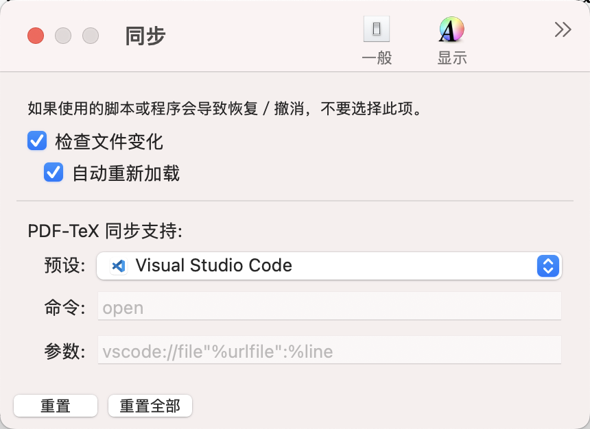

## 通用配置

```json-doc
{
  // 编译工具
  "latex-workshop.latex.tools": [
      {
        "name": "latexmk",
        "command": "latexmk",
        "args": [
          "-pvc-",
          "%DOCFILE%"
        ]
      },
      {
        "name": "latexmk-xelatex",
        "command": "latexmk",
        "args": [
          "-xelatex",
          "-synctex=1",
          "-interaction=nonstopmode",
          "-halt-on-error",
          "-file-line-error",
          "-pv",
          "%DOCFILE%"
        ]
      },
      {
        "name": "xelatex",
        "command": "xelatex",
        "args": [
          "-synctex=1",
          "-interaction=nonstopmode",
          "-file-line-error",
          "%DOC%"
        ]
      },   
      {
        "name": "pdflatex",
        "command": "pdflatex",
        "args": [
          "-synctex=1",
          "-interaction=nonstopmode",
          "-file-line-error",
          "%DOC%"
        ]
      },
      {
        "name": "bibtex",
        "command": "bibtex",
        "args": [
          "%DOCFILE%"
        ]
      },
      {
        "name": "biber",
        "command": "biber",
        "args": [
          "%DOCFILE%"
        ]
      }
    ],
  // Compiling Recipes
  "latex-workshop.latex.recipes": [
    {
      "name": "pdflatex",
      "tools": ["pdflatex"]
    },
    {
      "name": "xelatex",
      "tools": ["xelatex"]
    },
    {
      "name": "latexmk",
      "tools": ["latexmk"]
    },
    {
      "name": "xelatex*2",
      "tools": [
        "xelatex",
        "xelatex"
      ]
    },
    {
      "name": "xelatex -> bibtex -> xelatex*2",
      "tools": [
        "xelatex",
        "bibtex",
        "xelatex",
        "xelatex"
      ]
    },
    {
      "name": "xelatex -> biber -> xelatex*2",
      "tools": [
        "xelatex",
        "biber",
        "xelatex",
        "xelatex"
      ]
    },
  ],
  // 定义默认的 recipe
  "latex-workshop.latex.recipe.default": "first",
  // 清理中间辅助文件
  "latex-workshop.latex.clean.fileTypes": [
    "*.aux",
    "*.bbl",
    "*.blg",
    "*.idx",
    "*.ind",
    "*.lof",
    "*.lot",
    "*.out",
    "*.toc",
    "*.acn",
    "*.acr",
    "*.alg",
    "*.glg",
    "*.glo",
    "*.gls",
    "*.ist",
    "*.fls",
    "*.log",
    "*.fdb_latexmk"
  ],
  // 编译出错时是否通过弹窗显示
  "latex-workshop.message.error.show": false,
  "latex-workshop.message.warning.show": false,
  "latex-workshop.synctex.afterBuild.enabled": true,
  // 保存时就启动 Build 编译，Build 默认调用 recipe 中的第一条命令，
  // 这里默认注释掉，如果需要可以取消注释
  "latex-workshop.latex.autoBuild.run": "never",
  "editor.tabSize": 2,
  "editor.wordWrap": "bounded",
  // 取当前窗口大小和 wordWrapColumn 的最小值来决定 VS Code 中一行的换行位置
  "editor.wordWrapColumn": 120,
  // 对不同后缀的文件进行格式关联
  "files.associations": {
    "*.sty": "latex-expl3",
    "*.def": "latex-expl3",
    "*.tex": "latex",
    "*.cls": "latex-expl3"
  },
  // 更加醒目的括号配对
  "editor.guides.bracketPairs": "active",
  // 如何选择自动补全
  "editor.suggestSelection": "first",

  "files.autoSave": "afterDelay",
  "security.workspace.trust.untrustedFiles": "open",
  "explorer.confirmDelete": false,
  "editor.detectIndentation": false,
  "workbench.editorAssociations": {
    "*.xlsx": "default",
    "*.jpg": "default"
  },
  "editor.fontLigatures": false,
  // highlight duplicated labels
  "latex-workshop.check.duplicatedLabels.enabled": true,
  // disable chktex linting
  "latex-workshop.linting.chktex.enabled": false
}
```

## PDF 阅读器配置

### macOS

推荐使用 [Skim](https://skim-app.sourceforge.io/) 作为外部阅读器，下载完成后，打开 skim 进入设置，在同步栏中勾选`检查文件变化`和`自动重新加载`，将 PDF-TeX 同步支持下面的预设选择为 `Visual Studio Code`。见下图：

<figure>
  
  <figcaption markdown="span">设置 Skim 的同步栏</figcaption>
</figure>

```json-doc
{
  "latex-workshop.view.pdf.viewer": "external",
  "latex-workshop.view.pdf.external.viewer.command": "/Applications/Skim.app/Contents/SharedSupport/displayline",
  "latex-workshop.view.pdf.external.viewer.args": [
    "0",
    "%PDF%"
  ],
  "latex-workshop.view.pdf.external.synctex.command": "/Applications/Skim.app/Contents/SharedSupport/displayline",
  "latex-workshop.view.pdf.external.synctex.args": [
    "-r",
    "-b",
    "%LINE%",
    "%PDF%",
    "%TEX%"
  ]
}
```

### Windows

```json-doc
{
  "latex-workshop.view.pdf.viewer": "external",
  "latex-workshop.view.pdf.ref.viewer": "external",
  "latex-workshop.view.pdf.external.viewer.command": "<SumatraPDFROOT>/SumatraPDF.exe",
  "latex-workshop.view.pdf.external.viewer.args": [
    "-inverse-search",
    "\"<VSCodeROOT>/bin/code.cmd\" -r -g \"%f:%l\"",
    "%PDF%"
  ],
  "latex-workshop.view.pdf.external.synctex.command":"<SumatraPDFROOT>/SumatraPDF.exe",
  "latex-workshop.view.pdf.external.synctex.args": [
    "-forward-search",
    "%TEX%",
    "%LINE%",
    "%PDF%",
  ],
}
```

## 文档及说明

### 编译 $\LaTeX$ 文件的方式

1. 打开命令面板（Command Palette），键入 Build LaTeX project，选择对应项，使用默认 recipe 编译。
2. 打开命令面板（Command Palette），键入 Build with recipe，然后选择需要用的 recipe 进行编译。
3. 点击左侧 $\TeX$ 徽章，在菜单栏中选择 Build LaTeX project，这里可以自行选择使用哪一个 recipe 进行编译。
4. 打开 VS Code 集成终端，手动键入编译命令。

### 正反向跳转 (macOS + Skim)

+ Source $\to$ PDF
  + `Option`+`Command`+`J` 跳转至 PDF 对应位置
  + `Option`+`Command`+`V` 跳转至 PDF 开头位置
+ PDF $\to$ Source: `Shift`+`Command`+`Click`

## 参考

+ [LaTeX Workshop Wiki](https://github.com/James-Yu/LaTeX-Workshop/wiki)
+ [install-latex-guide-zh-cn](https://github.com/OsbertWang/install-latex-guide-zh-cn)