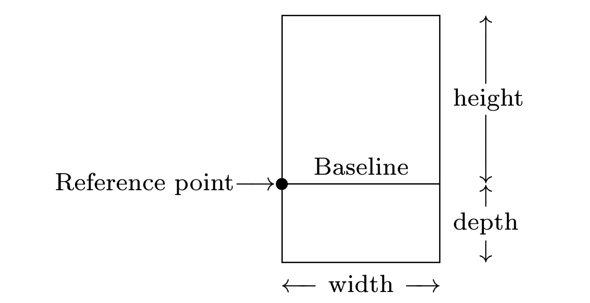

$\TeX$ 中的盒子就是一个带有三个参数的二维矩形，这三个参数分别为高度、宽度、深度，如下图所示：

<figure>
  
  <figcaption markdown="span">$\TeX$ 中的盒子模型</figcaption>
</figure>

在 $\TeX$ 看来，单个字符就是一个盒子，并且是最简单的一类盒子。字体设计者决定了字符的高度、宽度和深度分别是多少，也决定了字符在盒子中长什么样子。$\TeX$ 使用这些参数将盒子粘在一起，最终确定页面中所有字符的参考点位置。例如，在 plain $\TeX$ 的 `\rm` 字体（`cmr10`）中，字母 h 的高度为 6.9444pt、宽度为 5.5555pt、深度为零；字母 g 的高度为 4.3055pt、宽度为 5pt、深度为 1.9444pt。尽管从名称上来看，`cmr10` 是一个 10-point 的字体，但是只有一些特殊字符（如圆括号）的高度加深度刚好等于 10pt。