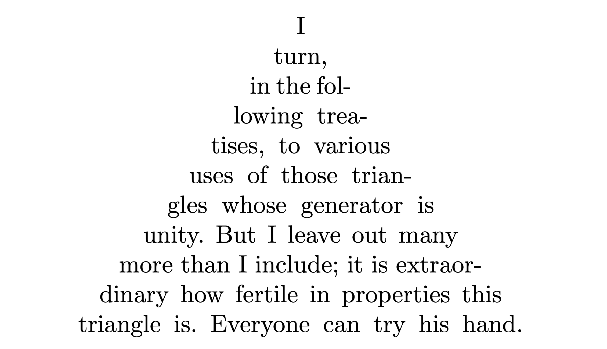

## 水平模式的 items

在断行之前，$\TeX$ 中的一个段落实际上是一个水平列表，也就是 $\TeX$ 在水平模式下收集到的一列 items，这些 items 可以分为下面八类：

+ 一个盒子（character, ligature, rule, hbox, vbox）
+ 一个任意可断点
+ 一个 'whatsit'
+ 垂直材料（来自 `\mark` 或者 `\vadjust` 或者 `\insert`）
+ 一个粘连团或者 `\leaders`
+ 一个 kern（类似于粘连，但是不能伸缩）
+ 一个惩罚
+ 公式开始或者公式结束

前四类为不可丢弃型，而后四类（glue, kern, penalty, math items）为可丢弃型，因为它们在断行处可能会改变或消失。

## 任意可断点

一个任意可断点（discretionary break）由三部分组成：
+ pre-break text
+ post-break text
+ no-break text

语法为

```tex
\discretionary{<pre-break text>}{<post-break text>}{<no-break text>}
```

如果在此处断行，则 pre-break text 会出现在当前行结尾，post-break text 会出现在下一行开头；如果不在此处断行，则 no-break text 会出现在当前行。

例如，可以在 difficult 的两个 f 间设置可断点：

```tex
di\discretionary{-f}{fi}{ffi}cult
```

但实际上，我们不需要手动设置，$\TeX$ 的连字算法会在幕后完成这些工作。

## 断行点

断行只能出现在水平列表的特定位置，具体来说，断行允许出现在下列五种情形中：

1. 在粘连处，只要这个粘连的前面是一个不可丢弃的 item 并且粘连不在数学公式中。粘连处的断行发生在 glue space 的左侧。
2. 在 kern 处，只要这个 kern 后面跟的是粘连并且不是数学公式的一部分。
3. 在数学公式结束处且公式后面跟的是粘连
4. 在一个惩罚处（公式中可能会自动插入 penalty）
5. 在任意可断点处

每一个潜在的可断点都有一个对应的惩罚值，这个惩罚值代表了在该点进行断行的“美学代价”。对于前三种情形，惩罚值为零；第 4 中情形的惩罚值是显式指定的；对于最后一种情形，我们要分两种情况讨论，如果 pre-break text 非空的话，那么惩罚值为 `\hyphenpenalty` 的当前值，如果 pre-break text 为空的话，那么惩罚值为 `\exhyphenpenalty` 的当前值。

> plain $\TeX$ 设置 `\hyphenpenalty=50`, `\exhyphenpenalty=50`

举个例子，如果你在段落中的某个点处插入 `\penalty 100`，那么这个点就成为了一个合法的断行点，但是会有一个 $100$ 的惩罚值。如果插入的是 `\penalty -100`，那么 $\TeX$ 会将此处视为一个相当好的断行点，因为负的惩罚值即为奖励值。

$\TeX$ 绝不会在惩罚值大于等于 $10000$ 的地方断行，与此对应，$\TeX$ 绝对会在惩罚值小于等于 $-10000$ 的地方断行。对此，plain $\TeX$ 定义了宏

```tex
\def\nobreak{\penalty10000 }
\def\break{\penalty-10000 }
\def\allowbreak{\penalty0 }
\def~{\penalty10000\ }
```

所以 `\nobreak` 禁止断行，`\break` 强制断行，`\allowbreak` 允许断行，`~` 为一个不可断行的空格（俗称为带子）。

当在某个点发生断行后，$\TeX$ 移除该断行点后面的所有可丢弃的 items，直到遇见不可丢弃的 item，或者直到遇见另一个被选择的断行点。

## 行的美观程度——badness

一行的 badness 是一个整数，近似等于 100 乘以一个比值的立方，这个比值就是为了得到所要求尺寸的 hbox，行中的粘连必须伸缩的比例。例如，如果粘连的总收缩能力是 10 points, 并且粘连总共被压缩了 9 points，那么 badness 的值是 73 (因为 $100\times(9/10)^3=72.9$)；类似地，如果粘连的伸长长度为其伸长能力的两倍，那么 badness 的值为 $100\times 2^3=800$。但是如果计算出来的 badness 的值超过了 $10000$，就会使用 $10000$ 这个值。（见第十二章关于粘连设置比率 $r$ 和粘连设置阶数 $i$ 的讨论，如果 $i\neq 0$，那么粘连具有无限伸缩性，于是 badness 的值恒为零，否则 badness 的值约等于 $\min(100r^3, 10000)$）。

如果一行的 badness 大于等于 13 的话，那么粘连设置比率必然超过了 50%。在这种情况下，根据粘连是收缩还是伸长，我们分别将这行称为 tight 的和 loose 的，如果 badness 大于等于 100，我们认为这一行 very loose。但如果 badness 小于等于 12，我们说这一行是不错的 (decent)。所以，根据 badness 的值，我们把行分为了四类：tight, decent, loose, very loose。相邻的两行被称为视觉上不兼容，如果它们所处的类别不相邻，也即，一个 tight line 邻接一个 loose line 或 very loose line，也可能是 decent line 邻接一个 very loose line。

$\TeX$ 对每个潜在的断行点序列进行评估，评估的方法计算每行的 demerit 值的总和。假设一行的 badness 值为 $b$，行末断行点对应的 penalty 值为 $p$。如果 $p\geq 10000$ 或者 $b$ 超过了当前的 tolerance 或 pretolerance 的值，$\TeX$ 根本不会考虑这样的断行，否则该行的 demerit 值定义为

$$
d = \begin{cases}
  (l+b)^2 + p^2, & \text{if } 0\leq p<10000; \\
  (l+b)^2 - p^2, & \text{if } -10000<p<0; \\
  (l+b)^2,       & \text{if } p\leq -10000.
\end{cases}
$$

这里的 $l$ 为 `\linepenalty` 的当前值，plain $\TeX$ 设置 `\linepenalty=10`。例如，如果某一行的 badness 值为 20，并且断行点在粘连处，那么 demerit 值为 $(10+20)^2=900$，因为在粘连处断行的惩罚值为零。

如果相邻的两行视觉上不兼容，那么 $d$ 的值会加上 `\adjdemerits`，如果相邻的两行都以任意可断点结尾，那么 $d$ 的值会加上 `\doublehyphendemerits`，如果倒数第二行以任意可断点结尾，那么 $d$ 会加上 `\finalhyphendemerits`。plain $\TeX$ 设置了三者的值分别为 10000、10000 和 5000。

## 断行前的工作

在 $\TeX$ 开始选择断行点前，它会做两件重要的事：

1. 如果当前水平列表最后的 item 为粘连，会将其丢弃。
2. 额外的三个 items 会添加到当前水平列表的末尾：`\penalty10000`（禁止断行）、`\hskip\parfillskip`（添加结束粘连至段落）、`\penalty-10000`（强制断行）。plain $\TeX$ 设置 `\parfillskip=0pt plus 1fil`，这会使得每个段落的最后一行被空白间距填充。当然，可以修改 `\parfillskip` 以实现特殊的效果，例如，如果设置 `\parfillskip=0pt`，那么段落的最后一行将会被文本填充至 right margin，请注意，如果段落没有足够的长度，其排版效果可能非常糟糕。

## `\leftskip` 和 `\rightskip`

$\TeX$ 中有两个参数叫做 `\leftskip` 和 `\rightskip`，这两个参数指定了插入在段落每行左右两侧的粘连，当计算 badness 和 demerit 的值时，这些粘连会被考虑进去。一般情况下，plain $\TeX$ 保持二者为零。有一个宏叫做 `\narrower`，它会把 `\leftskip` 和 `\rightskip` 都加上 `\parindent` 的值：

```tex
\def\narrower{\advance\leftskip by\parindent
  \advance\rightskip by\parindent}
```

可以使用 `\narrower` 来引用文本，如：

```tex
{\narrower\smallskip\noindent
This paragraph will have narrower lines than
the surrounding paragraphs do, because it
uses the ``narrower'' feature of plain \TeX.
The former margins will be restored after
this group ends.\smallskip}
```

第二个 `\smallskip`[^smallskip] 会结束段落，一定要在结束编组之前结束段落，否则 `\narrower` 的效果会在 $\TeX$ 选择断行点之前消失。

[^smallskip]: 注意 `\smallskip` 在 plain $\TeX$ 和 $\LaTeX$ 中的定义不同，这会导致上面的用法在 $\LaTeX$ 中失效，见 [Why does \narrower not work in LaTeX as in plain TeX?](https://tex.stackexchange.com/questions/568415/why-does-narrower-not-work-in-latex-as-in-plain-tex) 中的讨论

> `\line`、`\leftline`、`\rightline` 和 `\centerline` 的定义并未将 `\leftskip` 和 `\rightskip` 考虑进去，为了改进这一点，我们可以将 `\line` 的定义改为 
> ```tex
> \def\line#1{\hbox to\hsize{\hskip\leftskip#1\hskip\rightskip}}
> ```
> 其它三个都是基于 `\line` 定义的，所以不用改动。

## `\parshape`

`\parshape` 可以用来创建任意的段落形状，语法为：`\parshape=`$n$ $i_1$ $l_1$ $i_2$ $l_2$ $\ldots$ $i_n$ $l_n$，意思是前 $n$ 行的长度分别为 $l_1,l_2,\ldots,l_n$ 且分别从左侧缩进长度 $i_1,i_2,\ldots,i_n$。如果段落不足 $n$ 行，多余的指定被忽略掉；如果段落超过 $n$ 行，那么第 $n$ 行的指定作用于后面各行。可以通过 `\parshape=0` 取消掉前面的效果。

下面的代码演示了用 `\parshape` 实现 Pascal 三角形的效果：

```tex
\newdimen\x
\x=8.9pt % 13.4pt, 18.1 pt, 22.6 pt, 32.6 pt, and 47.2 pt
\setbox1=\hbox{I}
\setbox0=\vbox{\parshape=11 -0\x0\x -1\x2\x -2\x4\x -3\x6\x
-4\x8\x -5\x10\x -6\x12\x -7\x14\x -8\x16\x -9\x18\x -10\x20\x \ifdim \x>2em \rightskip=-\wd1
\else \frenchspacing \rightskip=-\wd1 plus1pt minus1pt
\leftskip=0pt plus 1pt minus1pt \fi
\parfillskip=0pt \tolerance=1000 \noindent I turn, in the following treatises, to various uses of those triangles whose generator is unity. But I leave out many more than I include; it is extraordinary how fertile in properties this triangle is. Everyone can try his hand.}
\centerline{\hbox to \wd1{\box0\hss}}
```

<figure>
  
  <figcaption markdown="span"></figcaption>
</figure>


## `\hangindent` 和 `\hangafter`

`\hangindent=<dimen>` 指定悬挂缩进的长度，`\hangafter=<number>` 指定在哪些行进行缩进。令 $x$ 和 $n$ 分别为二者的值，并令 $h$ 为 `\hsize` 的值；如果 $n\geq 0$，则悬挂缩进发生于段落的第 $n+1$ 行至最后一行；如果 $n<0$，则悬挂缩进发生于段落的第一行至第 $\lvert n\rvert$ 行。悬挂缩进意味着这些行的宽度为 $h-\lvert x\rvert$ 而不是 $h$；若 $x\geq 0$，则从左侧进行缩进，否则从右侧进行缩进。


断行完成之后，$\TeX$ 将这些行加入到当前垂直列表，并插入行间粘连（见第 12 章），行间粘连依赖于 `\baselineskip`、`\lineskip` 和 `\lineskiplimit` 的值。为了帮助控制后面的分页，$\TeX$ 还会在每个行间粘连前插入 penalty。

---
未完待续……

<div id="footnotes"></div>