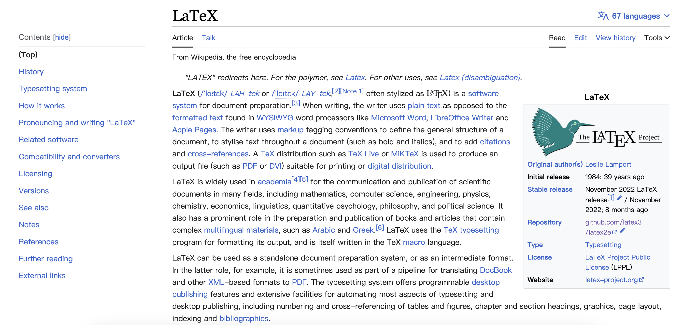
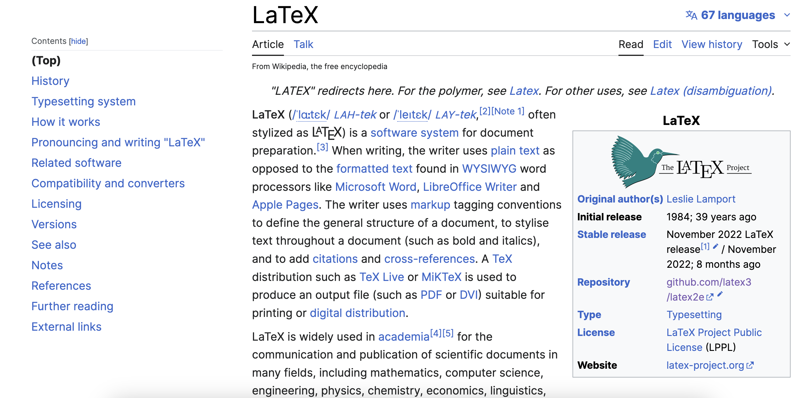

最近发现一个非常好用的浏览器插件——Stylebot ([Github 地址](https://github.com/ankit/stylebot)、[主页地址](https://stylebot.dev/))，在 Chrome、Firefox、Edge 上都可以使用。

通过这个插件可以为网页添加样式表，改变网页的字体、字号等元素，愿意折腾的话甚至还可以改变网页原布局，但前提是需要懂一些 HTML 和 CSS 相关的知识。

以维基百科为例，其默认字体不太好看（对于我个人而言），我将其字体改成了 Inter 字体，字号也调大了一些，效果看起来舒服多了：

<figure>
  
  <figcaption markdown="span">默认效果</figcaption>
</figure>

<figure>
  
  <figcaption markdown="span">设置后的效果</figcaption>
</figure>